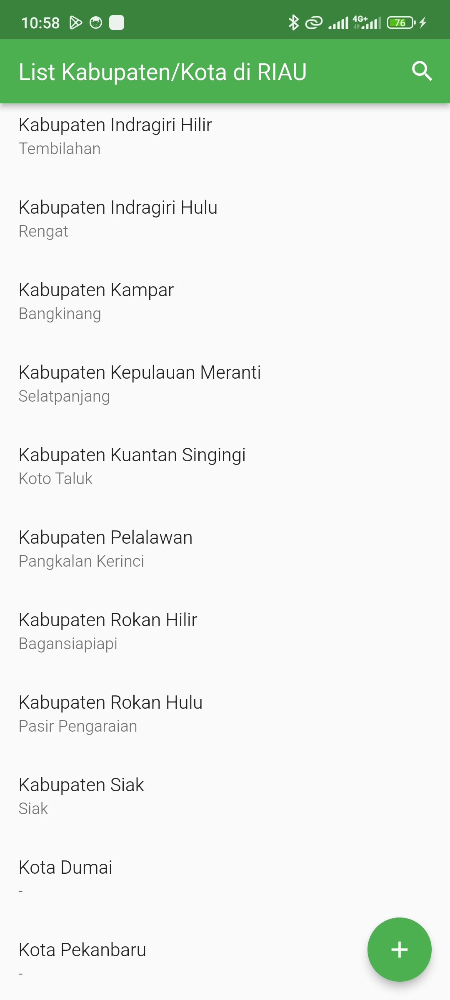
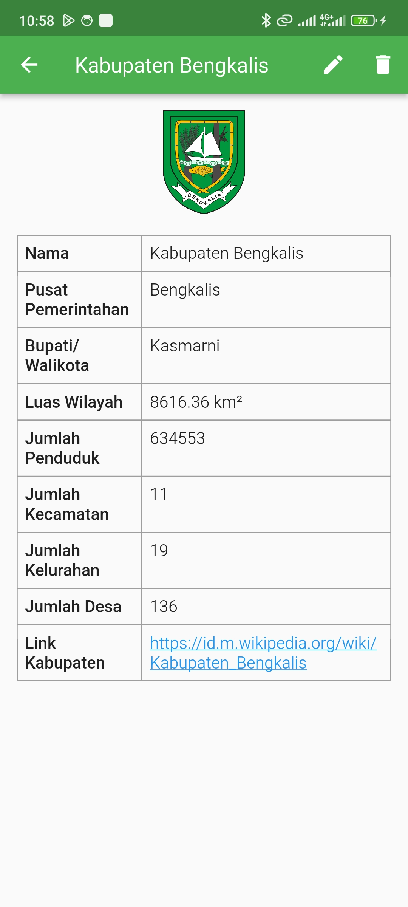
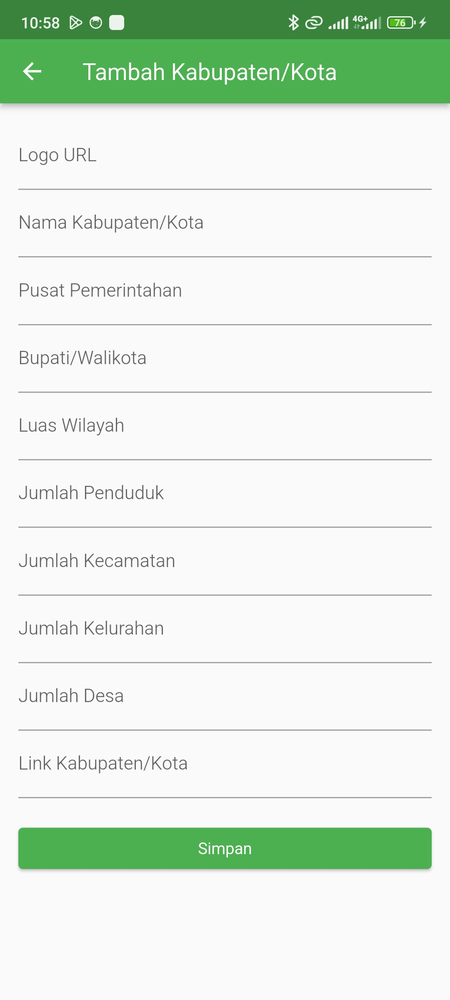
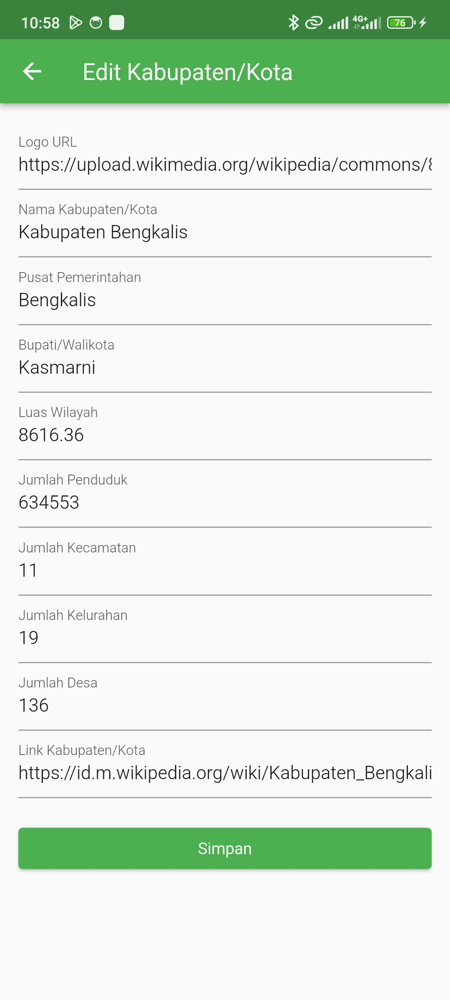
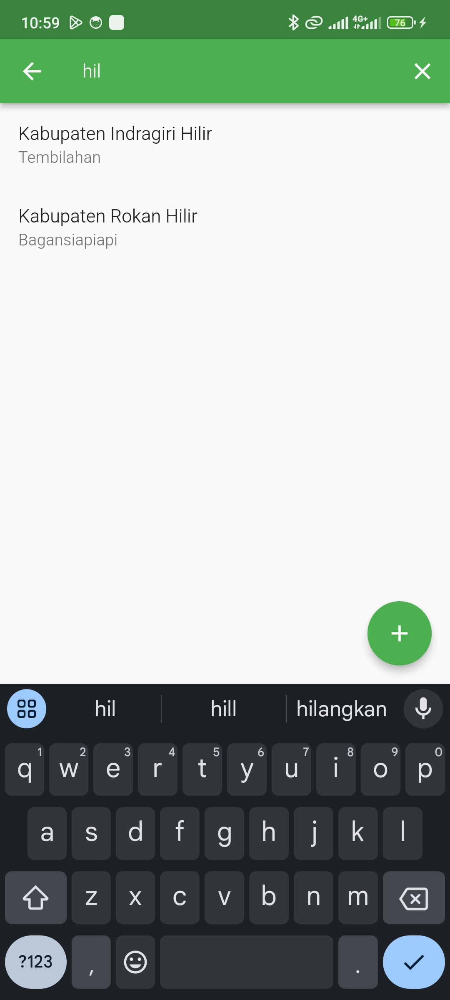

# 📱 Aplikasi Informasi Kabupaten/Kota Riau

Aplikasi mobile yang menyediakan informasi lengkap tentang kabupaten dan kota di Provinsi Riau. Dibangun menggunakan Flutter framework dan SQLite sebagai basis data lokal.

## ✨ Fitur Aplikasi
- 📋 Menampilkan daftar kabupaten/kota di Provinsi Riau
- 💾 Menyimpan dan mengelola informasi detail setiap kabupaten/kota
- 🔄 Mendukung operasi CRUD (Create, Read, Update, Delete) untuk data kabupaten/kota
- 🗂️ Penyimpanan data secara lokal menggunakan SQLite
- 📱 Antarmuka pengguna yang responsif dan mudah digunakan

## 📸 Screenshots Aplikasi

| Halaman Utama               | Detail Kota/Kabupaten    | Form Tambah Data       | Form Edit                 | Halaman Pencarian            |
|-----------------------------|--------------------------|------------------------|---------------------------|------------------------------|
|     |  |  |   |  |

## 🛠️ Teknologi yang Digunakan
- 🎯 Flutter SDK
- 💻 Dart programming language
- 🗄️ SQLite database
- 📊 Provider state management
- 🎨 Flutter Material Design

## 📥 Cara Instalasi
1. Clone repository ini:
```bash
git clone https://github.com/zizfiq/kabupaten_kota.git
```

2. Masuk ke direktori proyek:
```bash
cd kabupaten_kota
```

3. Install dependencies:
```bash
flutter pub get
```

4. Jalankan aplikasi:
```bash
flutter run
```

## 📖 Cara Penggunaan
1. 📱 Buka aplikasi
2. 📋 Pada halaman utama, akan ditampilkan daftar kabupaten/kota di Riau
3. ➕ Tekan tombol + untuk menambahkan data kabupaten/kota baru
4. 👆 Tekan salah satu item untuk melihat detail informasi
5. ✏️ Gunakan tombol edit untuk mengubah informasi
6. 🗑️ Gunakan tombol hapus untuk menghapus data

## 📄 Lisensi
Untuk detail lebih lanjut, silakan baca [LICENSE](LICENSE).
